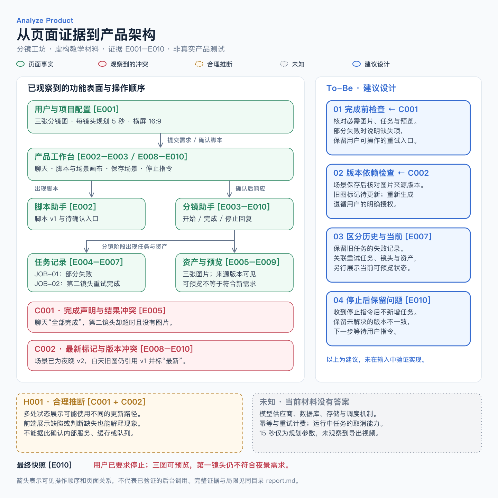

# 完整示例：分镜工坊

**全部为虚构教学材料。** 产品名、Agent 名称、任务、资产和界面文案均为本示例构造，不是任何公司的实际记录，不代表真实产品测试、客户案例或性能评测。

示例目标是演示如何从有限记录得出有边界的结论。输入采用文字化的模拟界面记录，没有伪装成真实截图。记录中“已确认”的含义仅是“在这组模拟材料里直接可见”。

## 阅读顺序

1. [请求](request.md)：本次只分析旅程、Agent 契约、冲突和架构，不要求功能等价提示词。
2. [原始输入](input/observations.md)：10 条顺序记录，包含操作、界面文案、任务与资产状态。
3. [参考报告](report.md)：证据台账、旅程、两名可见 Agent、两个冲突、架构及未知项。
4. [架构 SVG](architecture.svg) / [PNG](architecture.png)：可编辑图与预览。
5. [验收场景](acceptance.md)：自检及输入变体，不是已执行的测试成绩。



## 在本地复现

安装 Skill 后，在这个仓库的根目录打开 Codex，发送：

```text
使用 $analyze-product，按照 analyze-product/examples/storyboard-demo/request.md 的要求，
读取 analyze-product/examples/storyboard-demo/input/observations.md。
本次只使用上述输入材料，不读取参考报告或架构图。
把你的结果写入工作目录下的新文件，保留原始示例。
```

完成后再与 [报告](report.md) 和 [验收场景](acceptance.md) 比较。关注是否把完成声明与资产状态分开、是否保留未解决冲突，以及是否给推断和建议加上标签。模型输出可以有不同表达和布局。

## 本例的关键发现

- E005 同时包含“全部生成完成”的聊天文案、失败任务和缺失资产；这一时点不能认定成功。
- E007 中的重试使当时的三张预览都可用，但不证明支持通用幂等机制。
- E008–E010 修改了场景并保留旧图，页面仍显示“最新”；截至最后一条记录，这个冲突未解决。
- 可见 Agent 只有“脚本助手”和“分镜助手”。模型供应商、后台数据库和队列保持未知。
